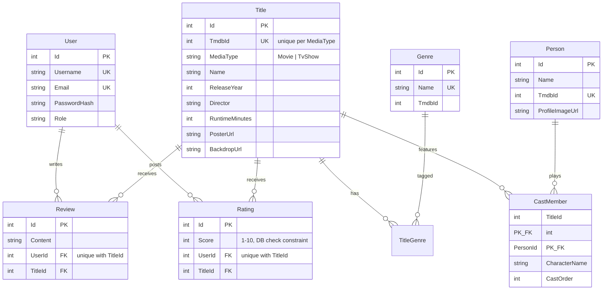

# Marquee — Movie Review Platform

A full-stack movie & TV review platform built as the final project for the **Service Oriented Architecture** course at South East European University.

**Author:** Arb Xhelili (Student ID: 131018) · Academic year 2025/2026

| | |
|---|---|
| Backend | ASP.NET Core Web API (.NET 10 LTS), strict 4-layer SOA |
| Database | PostgreSQL on Supabase, EF Core 10 + Npgsql, code-first migrations |
| Auth | JWT bearer tokens, BCrypt password hashing, role-based authorization (Admin / User / Guest) |
| External service | TMDB API — real movie/TV metadata, HD artwork, full cast |
| Frontend | React 19 + TypeScript (Vite), Tailwind CSS 4, GSAP, Three.js (react-three-fiber) |
| Tests | 89 xUnit tests across controllers, services and repositories (Moq, FluentAssertions, SQLite) |
| Hosting | API on Render (Docker), frontend on Vercel, DB on Supabase |
| CI/CD | GitHub Actions — build + test gate every deploy |

## Architecture

Strict four-layer architecture. Each layer talks only to the layer directly below it, always through interfaces:

```
Client (React SPA)
   │  HTTPS / JSON
   ▼
Controllers      — routing, status codes, zero business logic
   ▼  (interfaces)
Services         — every business rule, DTO ⇄ entity mapping, TMDB orchestration
   ▼  (interfaces)
Repositories     — EF Core queries, database I/O, computed statistics
   ▼
AppDbContext     — PostgreSQL (Supabase)
```

Repositories and services are registered with **Scoped** lifetime in `Program.cs`; services depend on repository **interfaces**, never concrete classes (Dependency Injection + Repository pattern). Entities never leave the service layer — every endpoint speaks DTOs.

### Entity-relationship model



### Business rules (service layer only)

1. One review **and** one rating per user per title (service check → 409, plus DB unique indexes)
2. Rating score must be 1–10 (service check → 400, plus DB check constraint)
3. A genre with titles assigned cannot be deleted (409)
4. A title with reviews or ratings cannot be deleted (409)
5. Users edit/delete only their own reviews and ratings — admins are exempt (403)
6. Title name unique per release year and media type; genre names unique (409)
7. `AverageRating`, `ReviewCount`, `TitleCount` are **computed** on response DTOs — never stored
8. TMDB import is idempotent: each TMDB entry imports once; genres and people are deduplicated by TMDB id (and adopted by name where a manual genre already exists), created atomically in one transaction

## API surface

| Method | Endpoint | Auth | Description |
|---|---|---|---|
| POST | `/api/auth/register` | — | Create account (role: User), returns JWT |
| POST | `/api/auth/login` | — | Login by username or email, returns JWT |
| GET | `/api/titles` | — | Catalog: `mediaType`, `genreId`, `search`, `sort` (newest/name/year/rating), `page`, `pageSize` |
| GET | `/api/titles/{id}` | — | Detail with genres, ordered cast and computed stats |
| POST / PUT / DELETE | `/api/titles…` | Admin | Manage catalog (delete blocked while reviews/ratings exist) |
| GET | `/api/genres`, `/api/genres/{id}` | — | Genres with title counts |
| POST / DELETE | `/api/genres…` | Admin | Manage genres (delete blocked while in use) |
| GET | `/api/reviews?titleId=n` | — | Reviews for a title |
| GET | `/api/reviews/mine` | User | The caller's reviews |
| POST / PUT / DELETE | `/api/reviews…` | User | One per title; ownership enforced, admin exempt |
| GET | `/api/ratings?titleId=n` | — | Ratings for a title |
| POST / PUT / DELETE | `/api/ratings…` | User | Score 1–10, one per title, ownership enforced |
| GET | `/api/users/me` | User | Profile with own reviews and ratings |
| GET | `/api/import/tmdb/search?query=` | Admin | TMDB multi-search, flags already-imported entries |
| POST | `/api/import/tmdb` | Admin | Import a movie/TV show with genres + top-12 cast |

Swagger UI with a JWT **Authorize** button is served at `/swagger` (the root URL redirects there).

## NuGet packages

**MovieReview.Api** — `Microsoft.EntityFrameworkCore` · `Npgsql.EntityFrameworkCore.PostgreSQL` · `Microsoft.EntityFrameworkCore.Design` · `Microsoft.AspNetCore.Authentication.JwtBearer` · `BCrypt.Net-Next` · `Swashbuckle.AspNetCore`

**MovieReview.Tests** — `xunit` · `xunit.runner.visualstudio` · `Microsoft.NET.Test.Sdk` · `Moq` · `FluentAssertions` · `Microsoft.EntityFrameworkCore.Sqlite` · `coverlet.collector`

**Tooling** — `dotnet-ef` (global tool)

All restore automatically on build (`dotnet restore` / opening the solution in Visual Studio 2026).

## Running locally

Prerequisites: **.NET 10 SDK**, **Node 22+**, a Supabase (or any PostgreSQL) database, a free **TMDB API key** ([themoviedb.org → Settings → API](https://www.themoviedb.org/settings/api)).

### Backend

```powershell
cd backend/src/MovieReview.Api
dotnet user-secrets set "ConnectionStrings:Default" "Host=<pooler-host>;Port=5432;Database=postgres;Username=postgres.<project-ref>;Password=<password>;SSL Mode=Require;Trust Server Certificate=true"
dotnet user-secrets set "Tmdb:ApiKey" "<your TMDB key or v4 read token>"
dotnet run --urls http://localhost:5200
```

On startup the API applies EF migrations and seeds the admin account (`admin` / `Admin:Password` config value — `Admin123!Dev` in Development). Open http://localhost:5200/swagger.

Or open `backend/MovieReview.slnx` in **Visual Studio 2026** and press F5 (user-secrets work the same).

### Frontend

```powershell
cd frontend
npm install
npm run dev          # http://localhost:5173 — proxied to the API via VITE_API_BASE_URL
```

### Tests

```powershell
cd backend
dotnet test          # 89 tests: services (business rules), repositories (SQLite), controllers
```

## Deployment

Full step-by-step guide: [docs/DEPLOYMENT.md](docs/DEPLOYMENT.md)

- **Database** — Supabase free tier (`eu-central-1`), schema applied via EF migrations, RLS enabled to lock Supabase's auto-generated REST surface (the API connects directly over Postgres).
- **API** — Render free Docker service from [render.yaml](render.yaml) blueprint + [backend/Dockerfile](backend/Dockerfile). Auto-deploy is off; GitHub Actions triggers the deploy hook only after tests pass. Note: the free tier sleeps after ~15 min idle, so the first request can take ~30–60 s.
- **Frontend** — Vercel Git integration, root directory `frontend`, env var `VITE_API_BASE_URL`. SPA rewrites via [frontend/vercel.json](frontend/vercel.json).
- **CI/CD** — [.github/workflows](.github/workflows): backend pipeline (restore → build → test → deploy hook) and frontend pipeline (typecheck + build).

## Repository structure

```
backend/
  src/MovieReview.Api/      Controllers · Services · Repositories · Domain · DTOs · Data ·
                            External/Tmdb · Auth · Middleware
  tests/MovieReview.Tests/  Controllers/ · Services/ · Repositories/ · TestHelpers/
  Dockerfile
frontend/
  src/                      api/ · auth/ · components/ · pages/ · styles/
docs/                       Deployment guide, diagrams
.github/workflows/          backend-ci.yml · frontend-ci.yml
render.yaml                 Render blueprint
```

## Attribution

Film and TV metadata and images are supplied by [TMDB](https://www.themoviedb.org/). This product uses the TMDB API but is not endorsed or certified by TMDB.
